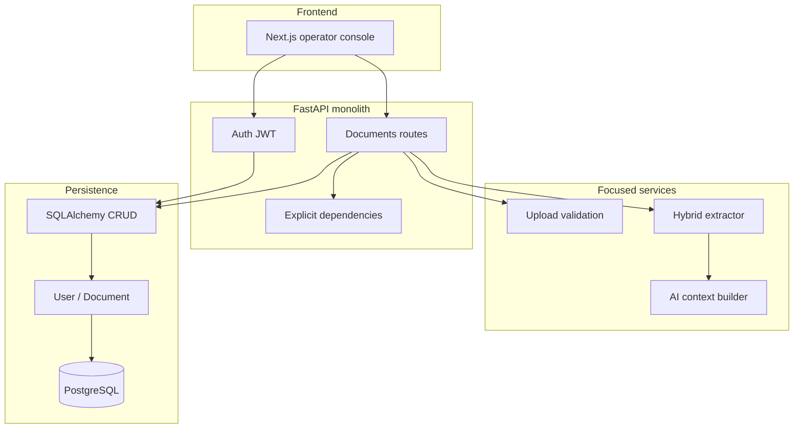
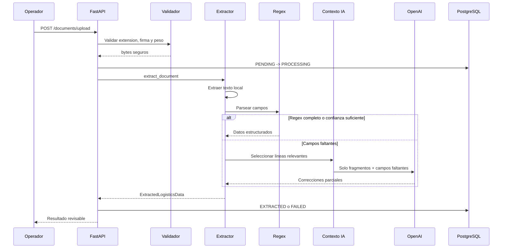

# LogisParse - Diagnostico y Arquitectura

## Diagnostico Honesto

El proyecto no necesita microservicios, CQRS, event sourcing ni DDD ceremonial.
El problema real es operativo: leer documentos tributarios/logisticos chilenos,
extraer campos, detectar inconsistencias y dejar una revision humana rapida.

La arquitectura correcta para este momento es un monolito modular:

- FastAPI para API y demo.
- SQLAlchemy async para persistencia.
- Servicios concretos para validacion y extraccion.
- IA como verificador parcial, no extractor principal.
- Tests simples y ejecutables localmente.

Lo que sobraba o hacia ruido:

- Mensaje de producto demasiado generico tipo SaaS logistico.
- Documentacion duplicada de arquitectura.
- Script `extractor.py` para empaquetar archivos hacia otra herramienta.
- Comentarios visuales con caracteres corruptos.
- Fallback IA que antes podia mandar una ventana grande de texto sin seleccionar
  fragmentos por campo faltante.

## Arquitectura Objetivo

## Pipeline Preciso

## Responsabilidades Finales

| Modulo | Responsabilidad |
| --- | --- |
| `api/v1/auth.py` | Registro y login |
| `api/v1/documents.py` | Flujo lineal de documento |
| `api/deps.py` | Settings, DB session y usuario actual |
| `services/upload_validation.py` | Validar nombre, bytes, extension y tamano |
| `services/document_extractor.py` | Texto local, regex, contexto IA y merge |
| `crud/` | Queries SQLAlchemy concretas |
| `models/` | Tablas persistidas |
| `schemas/` | Contratos HTTP y extraccion |
| `frontend/` | Consola Next.js conectable |

## Refactors Concretos Realizados

- Fallback IA ahora usa `build_ai_context()` y limita contexto a fragmentos.
- Tests subidos a 92% de cobertura.
- Tests directos cubren rutas y dependencias sin depender del hilo de `TestClient`.
- README reescrito con foco SII/logistica chilena.
- Guia frontend agregada.
- Frontend Next.js + Tailwind scaffolded.
- `extractor.py` eliminado.
- Documentacion de arquitectura duplicada eliminada.

## Que Eliminaria Ya

Ya eliminado:

- `extractor.py`, porque era un script utilitario externo al producto.
- `docs/ARCHITECTURE.md`, porque duplicaba la fuente de verdad.

Mantendria por ahora:

- `crud/`, porque es pequeno y claro.
- `core/middleware.py`, porque request-id y rate-limit ayudan en demo.
- `migrations/`, porque el esquema debe ser reproducible.

## Hoy vs v2

Hoy:

- Subir documento.
- Validar archivo.
- Extraer campos.
- Guardar estado.
- Revisar resultado.
- Mostrar consola frontend conectable.

v2:

- Endpoint formal de aprobacion/correccion humana.
- Historial por campo corregido.
- Validaciones SII por tipo de documento.
- Exportacion operacional.
- Almacenamiento seguro de documentos originales.
- Rate limit externo si hay multiples replicas.

## Nivel Concurso Ganador

La demostracion debe ser breve y concreta:

1. Subir una guia o PDF de ejemplo.
2. Mostrar que regex extrae campos sin IA cuando puede.
3. Mostrar que la IA recibe solo fragmentos en casos incompletos.
4. Mostrar estado persistido y resultado revisable.
5. Explicar que el humano decide el cierre, no el modelo.

La tesis tecnica es fuerte porque no vende magia: combina reglas locales,
IA acotada y trazabilidad para reducir trabajo manual real.
