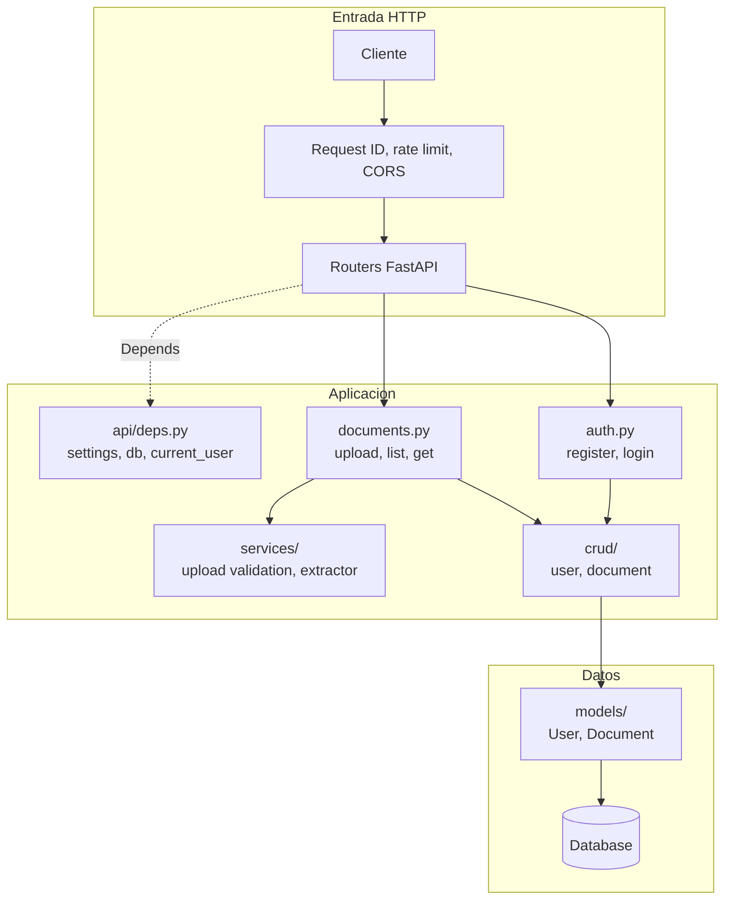
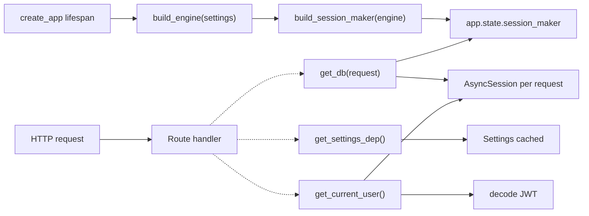
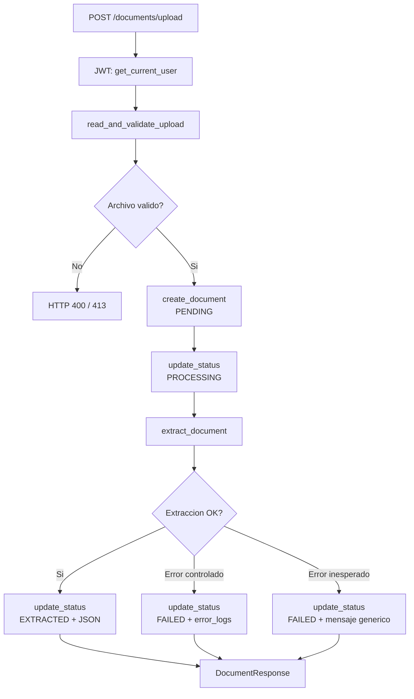
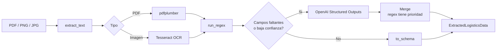
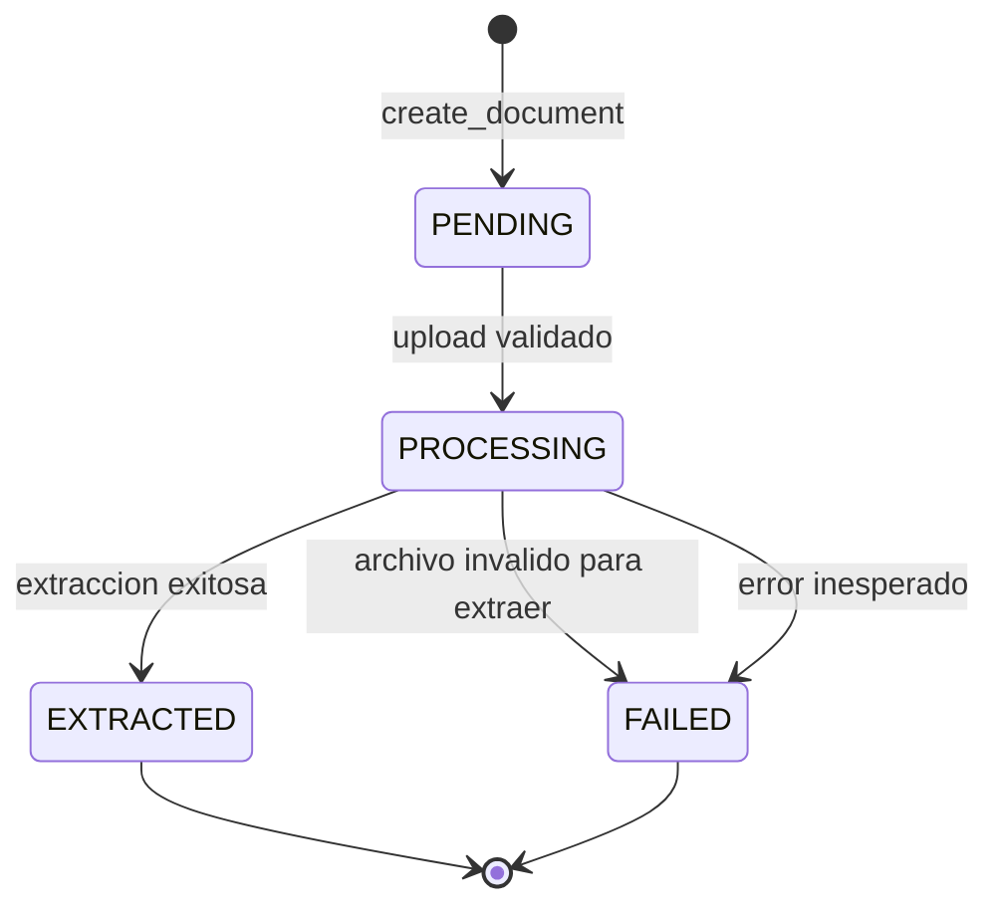
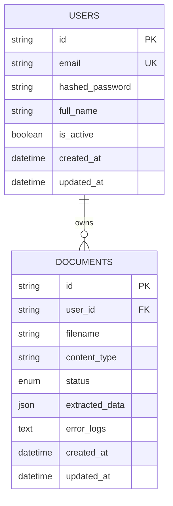
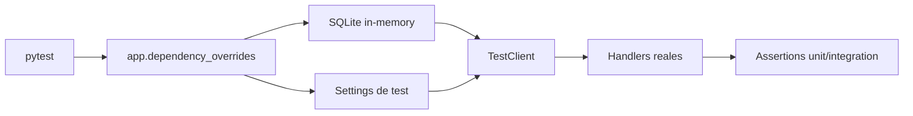

# LogisParse - Arquitectura Visual

Este documento explica como se mueve una request por el sistema y donde vive cada responsabilidad. No describe features futuras: refleja el codigo actual.

## 1. Mapa del Sistema

## 2. Dependency Injection

La app no crea sesiones de base de datos dentro de los handlers. El `lifespan` inicializa engine y session maker; cada request recibe sus dependencias con `Depends()`.

## 3. Upload y Extraccion

## 4. Pipeline del Extractor

## 5. Estados del Documento

## 6. Modelo de Datos

## 7. Arquitectura de Tests

## Lectura Arquitectonica

| Decision | Valor |
| --- | --- |
| Monolito modular | Menos piezas operacionales, mas claridad para el concurso |
| DI explicita | Handlers testeables y sin sesiones globales |
| Extractor hibrido | Regex rapido primero, AI solo para completar |
| Estados persistidos | Trazabilidad de cada documento |
| Tests con overrides | Misma API, infraestructura reemplazable |

## Observaciones Reales

| Punto | Lectura |
| --- | --- |
| `upload_validation.py` usa `settings` directo | Funciona, pero no sigue al 100% el patron DI usado por los routers |
| Rate limit en memoria | Correcto para una instancia; en despliegue multi-replica requeriria almacenamiento compartido |
| AI fallback por umbral | Si regex supera el umbral, campos faltantes pueden quedar vacios por decision del pipeline |
