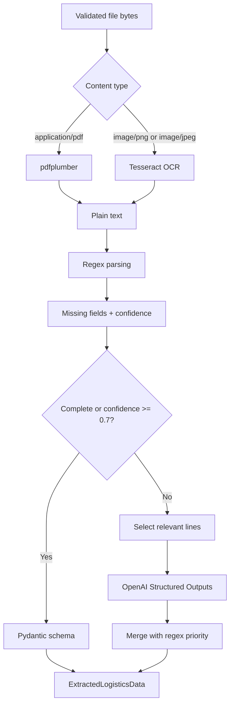

# AI Extraction Pipeline

LogisParse uses AI as a verifier and fallback. The default path is local:
text extraction, regex parsing and normalization.

## Flow



## Token Control

The AI prompt receives:

- Missing field names.
- Known regex data.
- Relevant fragments selected by field keywords.

It does not receive the full document. The current context limit is defined in
`app/services/document_extractor.py` as `AI_CONTEXT_CHAR_LIMIT`.

## Merge Rule

Regex wins over AI:

```text
final_field = regex_field or ai_field
```

This keeps deterministic extraction as the source of truth and uses AI only
where local parsing is incomplete.

## Output Contract

| Field | Meaning |
| --- | --- |
| `origen` | Dispatch origin |
| `destino` | Dispatch destination |
| `patente_camion` | Truck plate |
| `chofer` | Driver name |
| `fecha_despacho` | Dispatch date in `YYYY-MM-DD` |
| `numero_guia` | Dispatch guide number |
| `items` | Cargo line items |
| `observaciones` | Notes for human review |

## Failure Shape

- Upload validation errors return HTTP `400` or `413` before creating a document.
- Extraction `ValueError` marks the document as `FAILED` with a controlled error.
- Unexpected extraction exceptions are logged and stored as generic `FAILED`.
- Successful extraction stores JSON in `documents.extracted_data`.
