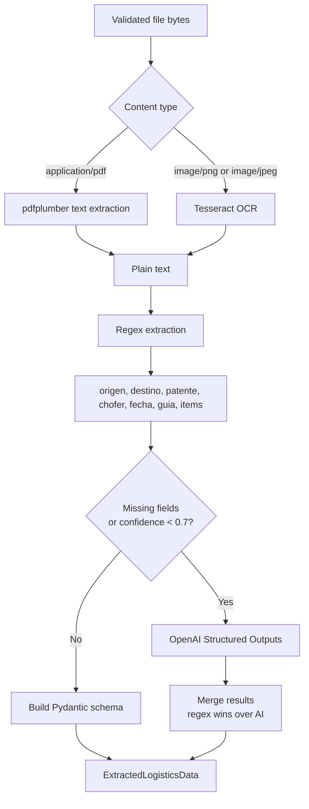

# AI Extraction Pipeline

The extractor is hybrid: deterministic parsing first, AI only when useful. This keeps common documents fast and makes OpenAI a fallback instead of the only path.

## Output Contract

The service returns `ExtractedLogisticsData`:

| Field | Meaning |
| --- | --- |
| `origen` | Dispatch origin |
| `destino` | Dispatch destination |
| `patente_camion` | Truck plate |
| `chofer` | Driver name |
| `fecha_despacho` | Dispatch date in `YYYY-MM-DD` |
| `numero_guia` | Dispatch guide number |
| `items` | Cargo line items |
| `observaciones` | Extra notes when detected |

## Failure Shape

- Upload validation errors return HTTP `400` or `413` before creating a document.
- Extraction `ValueError` marks the document as `FAILED` with the controlled error.
- Unexpected extraction exceptions are logged and stored as a generic `FAILED` result.
- Successful extraction stores JSON in `documents.extracted_data`.
