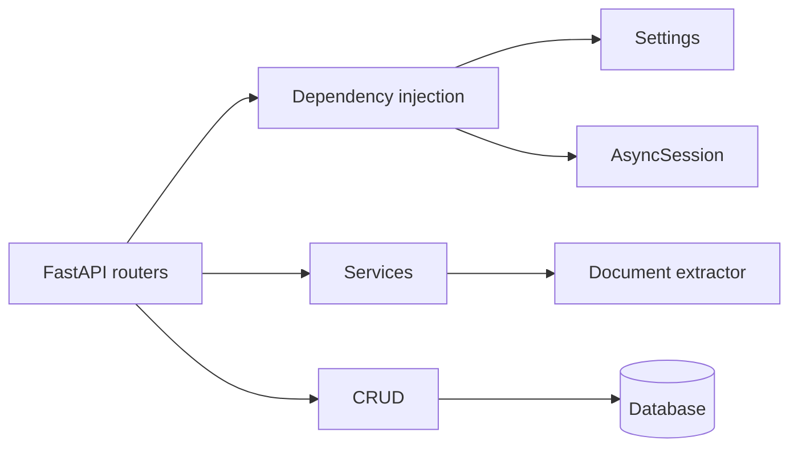

# Architecture Notes

LogisParse is a modular FastAPI backend. The application keeps the operational shape small: HTTP API, explicit dependencies, async persistence and a focused extraction service.

## Boundaries

| Area | Responsibility |
| --- | --- |
| `api/v1` | HTTP contracts and status codes |
| `api/deps.py` | Request dependencies: settings, DB session, authenticated user |
| `core` | Infrastructure: config, database, security, middleware |
| `services` | File validation and document extraction |
| `crud` | SQLAlchemy persistence operations |
| `models` | Database tables |
| `schemas` | Pydantic request/response and extraction contracts |

## Principle

Keep business flow visible in the route, keep infrastructure injected, and keep document parsing isolated in services.
