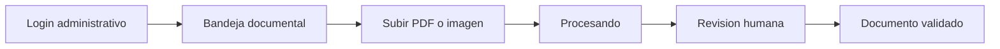

# Frontend Connection Guide

This guide describes how to connect the planned Next.js + Tailwind frontend to
the current FastAPI backend.

## Local Services

Run the API:

```bash
.venv\Scripts\python.exe -m uvicorn app.main:app --reload --port 8000
```

Run the frontend:

```bash
cd frontend
npm.cmd install
npm.cmd run dev
```

Set the frontend API URL:

```env
NEXT_PUBLIC_API_URL=http://localhost:8000
```

## Screen Flow



## Integration Steps

1. Use `POST /api/v1/auth/login` and keep the JWT in memory for the session.
2. Use `POST /api/v1/documents/upload` with `multipart/form-data`.
3. Refresh `GET /api/v1/documents` after upload completes.
4. Render `extracted_data` as editable review fields.
5. Keep the final approve/correct workflow as v2 until the backend exposes a
   review endpoint.

## UX Rules

Keep the interface operational and quiet:

- One upload action.
- One document list.
- One review panel.
- Explicit status: `PENDING`, `PROCESSING`, `EXTRACTED`, `FAILED`.
- Show AI as assistance, not as final authority.

## Future Backend Endpoint

For v2, add:

```text
PATCH /api/v1/documents/{document_id}/review
```

Suggested body:

```json
{
  "corrected_data": {},
  "review_status": "APPROVED",
  "review_notes": "Validado por operador"
}
```
